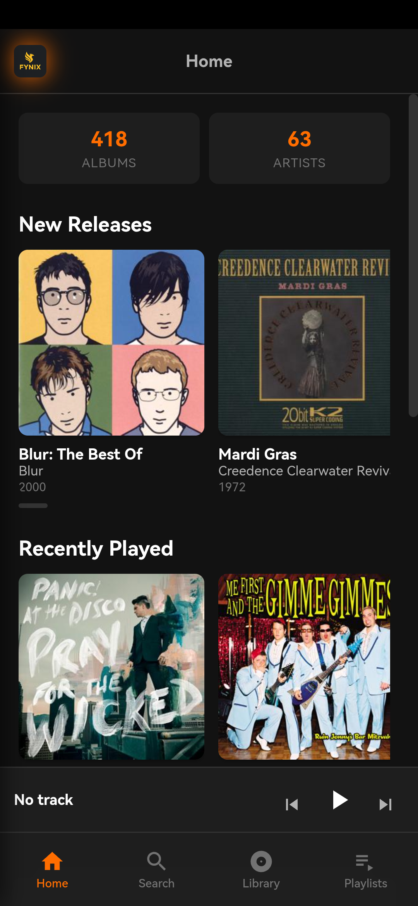
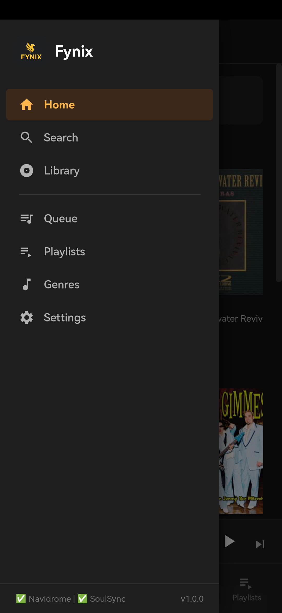

# Fynix Player (vibe coded in conjuction with OpenCode and Big Pickle. This app contains code produced by AI)

A light-weight, self-contained Android music player that connects to [Navidrome](https://www.navidrome.org/) and [SoulSync](https://github.com/Nezreka/SoulSync) for browsing, streaming, and managing your music library. Built as a WebView wrapper with an embedded HTTP server — no external dependencies on the phone.

<p>
  
  
</p>

## Features

### Music Playback
- **Navidrome streaming** — browse albums, artists, playlists, genres; search tracks; stream via MP3 transcoding
- **Play All / Shuffle All** — play or shuffle entire albums, artists, genres, or your full library
- **Queue management** — play, shuffle, repeat, seek, volume control with a persistent queue
- **Crossfade & Gapless** — smooth transitions between tracks
- **Equalizer** — 10-band EQ with presets, enabled directly in the player
- **Sleep timer** — set playback to stop after a duration

### Library & Browsing
- **Lazy-loaded library** — albums, artists, and tracks load in batches of 30 with infinite scroll
- **Artist pages** — biography modal (MusicBrainz + Wikipedia), discography search, genre tags
- **Rich metadata** — clickable artist/album links throughout the UI
- **Genre browser** — browse music by genre with dedicated genre track pages

### SoulSync Integration
- **Wishlist management** — search SoulSync, add tracks/albums/artists to your wishlist
- **Filter pills** — filter wishlist by status (pending, downloading, completed, error)
- **One-tap wishlist** — add any album to your SoulSync wishlist from yor soulsync connected services
- **Download tracking** — monitor download progress and stats

### Setup & Onboarding
- **Setup wizard** — guided 4-step first-run flow (Welcome, Navidrome, SoulSync, Done)
- **Guided tour** — 7-stop interactive tour covering all main UI sections
- **In-app configuration** — all server settings adjustable from Settings at any time

### Android Integration
- **Android Auto** — browse artists/albums/playlists from your car head unit; voice search via Google Assistant; Shuffle All
- **Lock-screen & notification controls** — play/pause/next/prev from notification, lockscreen, and Bluetooth
- **Picture-in-Picture** — continue watching now-playing info while using other apps
- **Edge-to-edge** — full-screen display with gesture navigation support
- **Monet theming** — dynamic color extraction from your wallpaper (Android 12+)
- **Embedded CORS proxy** — NanoHTTPD server inside the APK handles all API requests (no external proxy needed)

### Visual
- **Dynamic colors** — album art drives accent colors in the now-playing screen
- **Blurred backdrop** — frosted-glass effect in the now-playing overlay
- **Dark theme** — full dark UI optimized for music listening

## Screenshots

| Screen | Description |
|--------|-------------|
|  | Dashboard with recently played, new releases, and random picks |
|  | Full navigation sidebar with server status and version |

## Download

Download the latest APK from the [Releases page](https://github.com/Boc86/fynix-player/releases) and sideload it on your Android device.

Minimum SDK: **26** (Android 8.0)  
Target SDK: **34** (Android 14)

## Configuration

### Navidrome

| Setting | Description |
|---------|-------------|
| Server URL | `http://your-navidrome-server:4533` |
| Username | Your Navidrome username |
| Password | Your Navidrome password |

### SoulSync

| Setting | Description |
|---------|-------------|
| Server URL | `http://your-soulsync-server:8008` |
| API Key | Your SoulSync API key (generate from SoulSync settings) |

All API calls go through the embedded local server proxy on Android (no CORS issues). Settings persist in Android SharedPreferences across app updates.

## Android Auto

Fynix Player supports Android Auto via the `MediaBrowserService` API:

- **Browse**: Artists → Albums → Songs; Playlists; All Songs (Shuffle All)
- **Play**: Tap any album, playlist, or search result
- **Voice Search**: Use Google Assistant to search your library
- **Shuffle All**: First item in Playlists shuffles your entire library

## Full Stack Setup

Fynix Player is designed as the Android front-end for a complete self-hosted music stack.

### Components

| Service | Role |
|---------|------|
| [Navidrome](https://www.navidrome.org/) | Music server — streams your library to Fynix Player |
| [SoulSync](https://github.com/Nezreka/SoulSync) | Soulseek download manager — searches and downloads music into your library |
| [slskd](https://github.com/slskd/slskd) | Soulseek client daemon — handles peer-to-peer searches and transfers |
| [Fynix Player](https://github.com/Boc86/fynix-player) | Android front-end — browse, stream, and manage your wishlist |

### Docker Compose

A `docker-compose.yml` is included in the repo root. It wires all three services together with persistent storage and sensible defaults:

```yaml
services:
  soulsync:
    image: ghcr.io/nezreka/soulsync:latest
    restart: unless-stopped
    ports:
      - "8008:8008"
    environment:
      - TZ=Europe/London
    volumes:
      - /mnt/music/downloads:/host/downloads
      - /mnt/music/library:/host/music
      - /mnt/music/incoming:/host/incoming
      - music-stack_soulsync_config:/app/config
      - /mnt/music-stack/soulsync/data:/app/data
      - /mnt/music-stack/soulsync/logs:/app/logs

  slskd:
    image: slskd/slskd:latest
    restart: unless-stopped
    ports:
      - "5030:5030"
      - "5031:5031"
      - "50300:50300"
    environment:
      - TZ=Europe/London
    volumes:
      - /mnt/music/slskd/slskd.yml:/app/slskd.yml
      - /mnt/music:/music

  navidrome:
    image: deluan/navidrome:latest
    user: "1000:1000"
    restart: unless-stopped
    ports:
      - "4533:4533"
    environment:
      - ND_MUSICFOLDER=/music
      - ND_DATAFOLDER=/data
      - ND_SCANINTERVAL=1m
      - ND_LOGLEVEL=info
    volumes:
      - /mnt/music/library:/music:ro
      - /mnt/music-stack/navidrome/data:/data

volumes:
  music-stack_soulsync_config:
```

### Data Flow

1. **slskd** handles Soulseek peer-to-peer searches and downloads
2. **SoulSync** manages the download queue, moves completed downloads to your music library, and notifies Navidrome to rescan
3. **Navidrome** scans the library and serves it via the Subsonic API
4. **Fynix Player** connects to Navidrome for browsing/streaming and to SoulSync for wishlist management

## Building from Source

```bash
git clone https://github.com/Boc86/fynix-player.git
cd fynix-player/android
./gradlew assembleDebug
```

The APK will be at `android/app/build/outputs/apk/debug/app-debug.apk`.

Requires Android Studio / SDK with API 34 installed.

## Tech Stack

- **Frontend**: Vanilla JS, CSS (no frameworks)
- **Backend**: NanoHTTPD (embedded Java HTTP server inside APK)
- **Android**: Kotlin, WebView, Media3/ExoPlayer, MediaBrowserService
- **APIs**: Subsonic (Navidrome), REST (SoulSync), MusicBrainz, Wikipedia

## License

MIT
